# productin
<h2>Technoligies used:</h2>
<h3>Frontend</h3>
<ul>
  <li>HTML</li>
  <li>CSS</li>
  <li>Bootstrap</li>
  <li>JavaScript</li>
</ul>
<h3>Backend</h3>
<ul>
  <li>Flask</li>
  <li>flask-sqlalchemy</li>
  <li>SQlite database</li>
  <li>flask-mail to send OTP for email verification</li>
</ul>
<h2>Description:</h2>

It is a product booking website where user can book products. It has signin and signup functionality using flask-login. Email verification is done using flask-mail while creating an account. 

<h2>Home page:</h2>
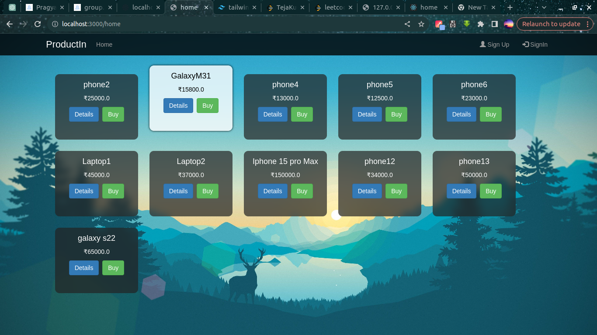
<h2>SignUp page:</h2>
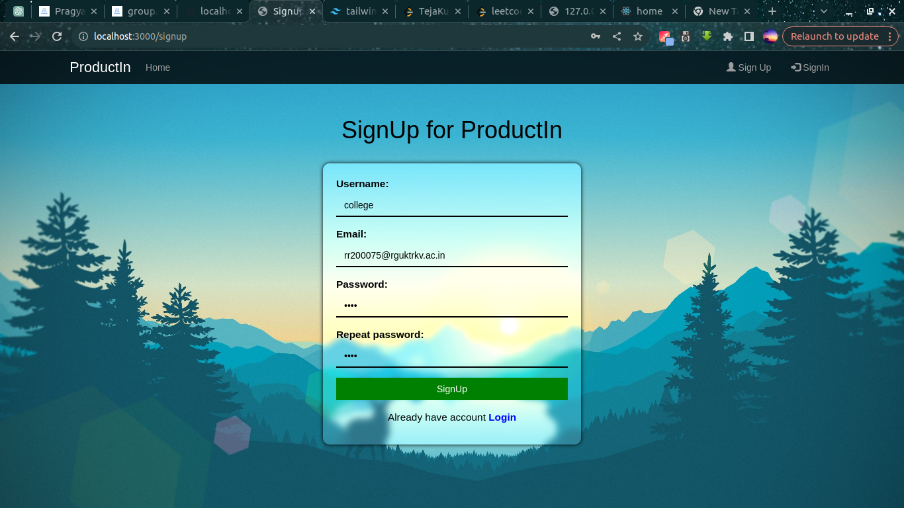
<h2>Email sending alert:</h2>
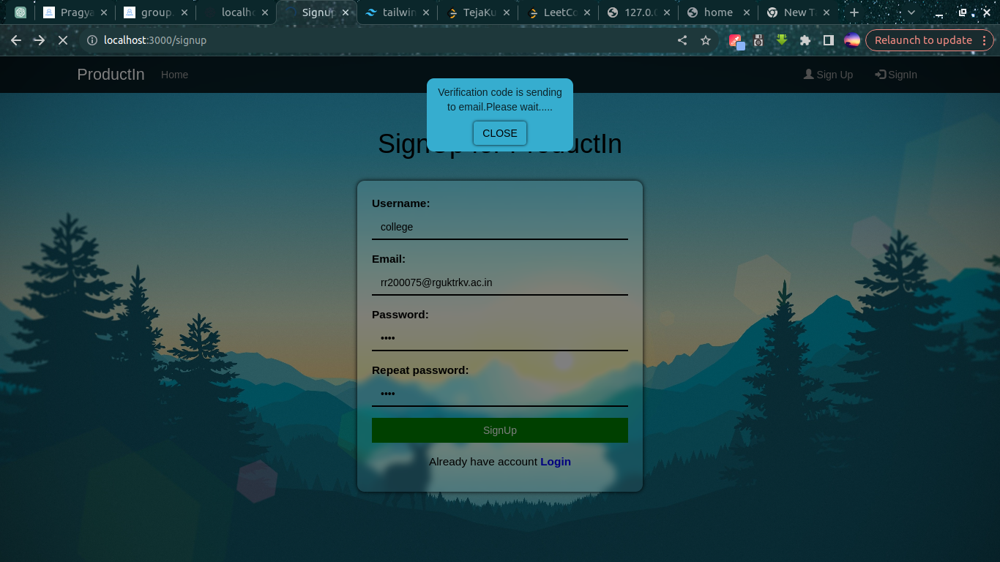
<h2>Sent mail UI:</h2>
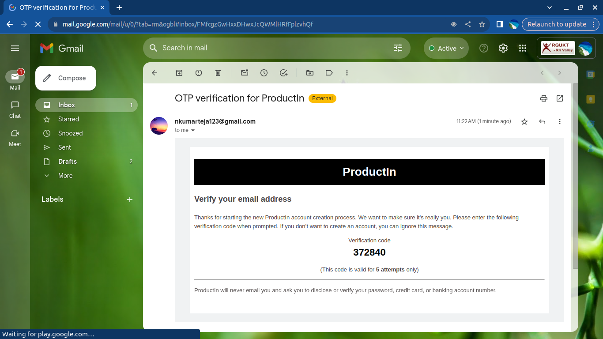
<h2>Email verification page:</h2>
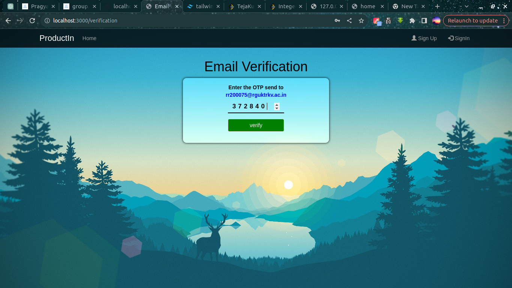
<h2>SignIn page:</h2>

After user login if he is admin, admin page will be displayed, otherwise userpage will be displayed.

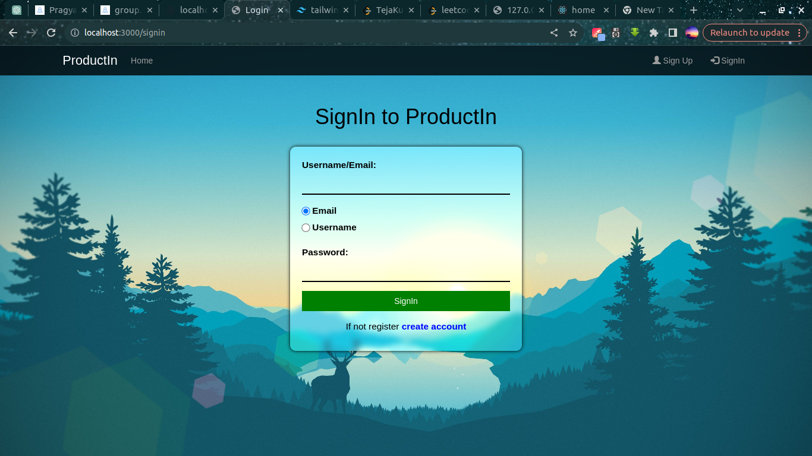
<h2>User page:</h2>
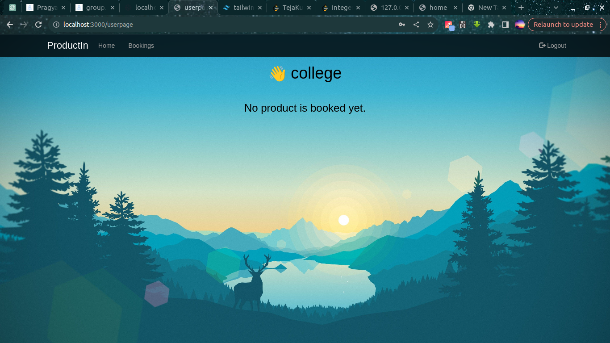
<h2>After booking 1st product:</h2>

User have the functionality of selling product.

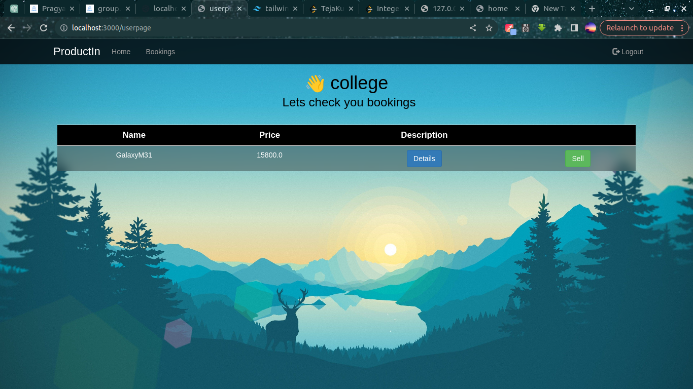
<h2>After booking 2nd product:</h2>
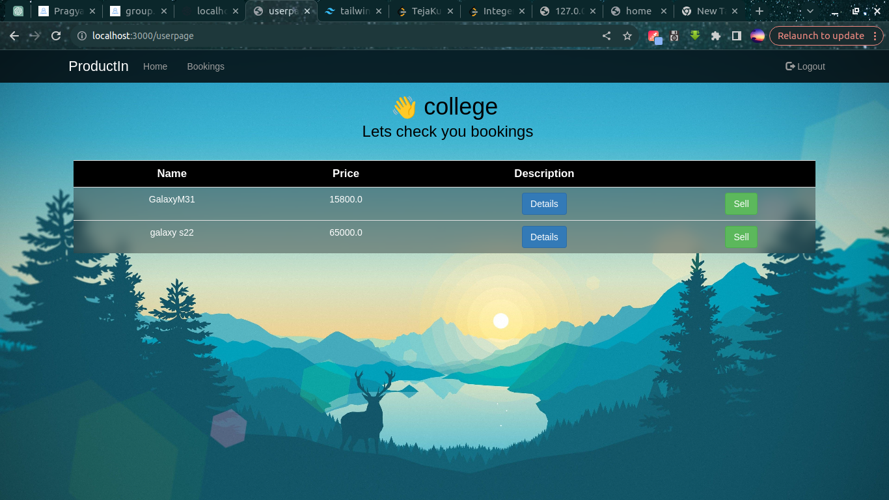
<h2>Admin page:</h2>
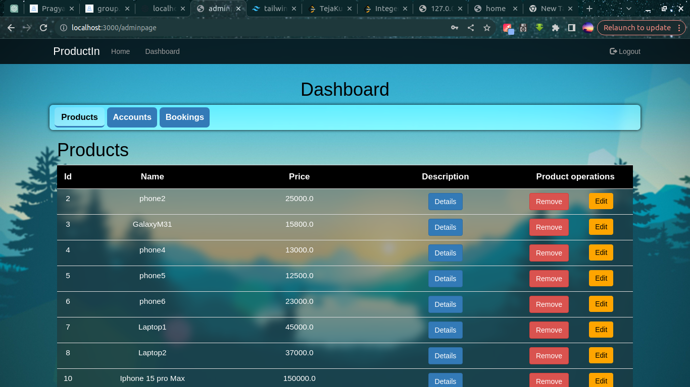
<h2>Products page(adding product):</h2>

Here admin have the functionality of adding and removing product.

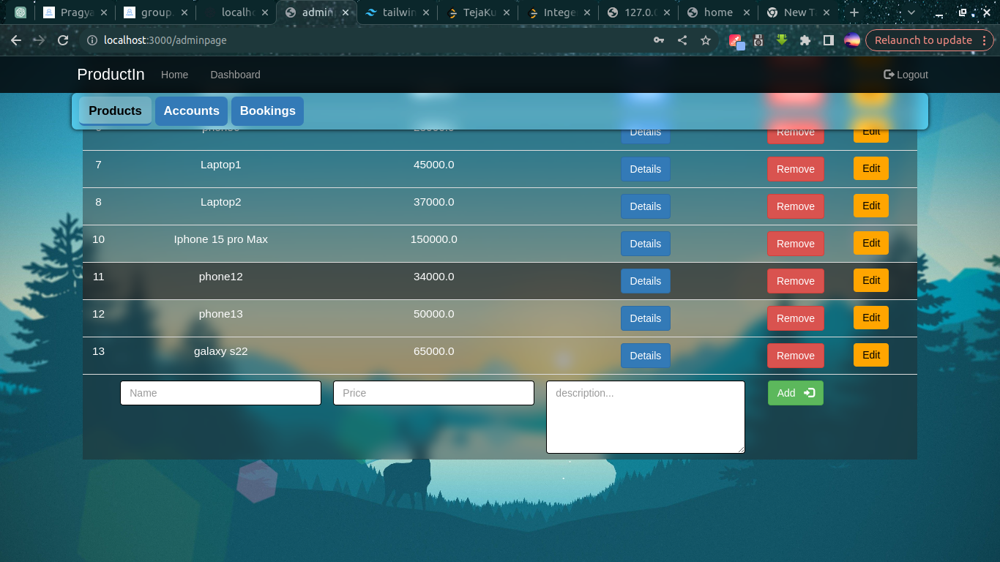
<h2>Products page(editing product):</h2>

Here admin have the functionality of inline editing of product details .

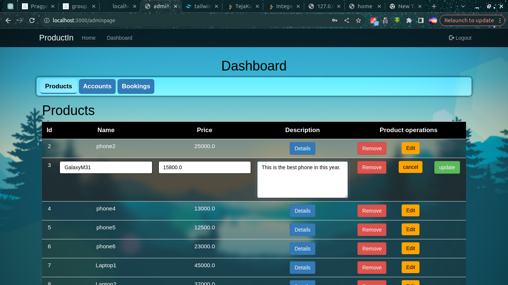
<h2>Accounts page:</h2>

Here admin have the functionality of adding and removing user.Password will be stored after hashing.

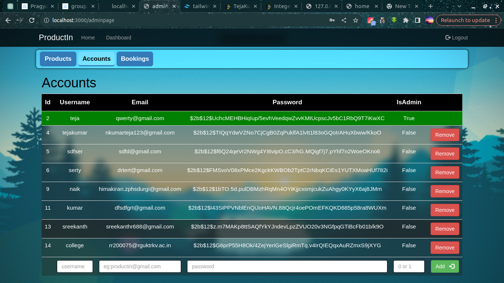
<h2>Bookings page:</h2>

Here admin can remove user bookings.

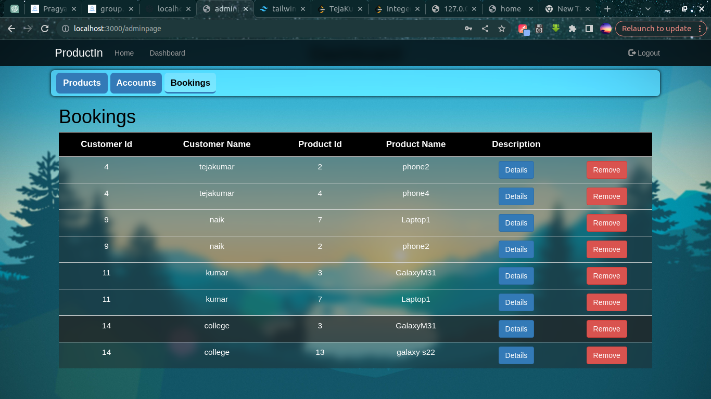
